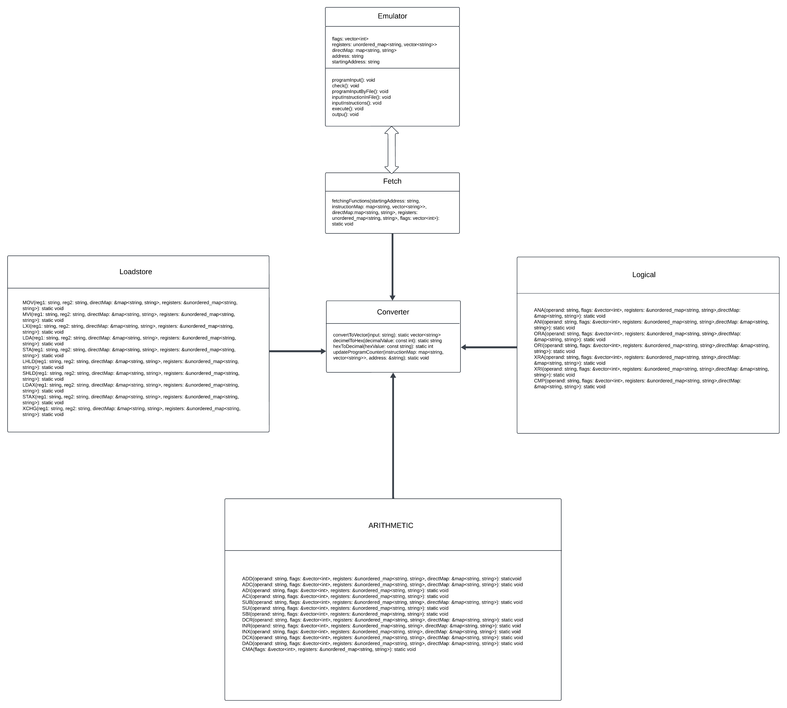
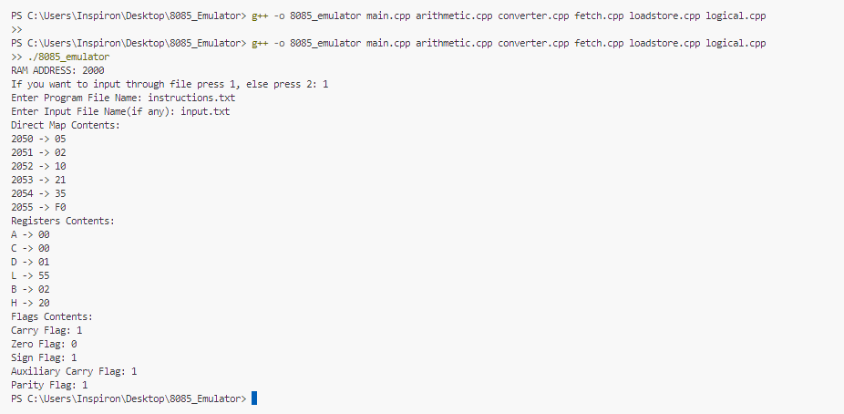

# 8085 Emulator

This project is an emulator for the 8085 microprocessor, implemented using C++.
The emulator provides a backend that can execute 8085 assembly code and simulate the behavior of the microprocessor.

## Features

- Emulates all 8085 instructions
- Supports loading and executing 8085 assembly programs
- Provides  output

### Unified Modelling Diagram(UML) of 8085 Emulator

 ```markdown
   

## Getting Started

### Prerequisites

- C++ compiler (e.g., GCC)
- 
### Building the Emulator

To build the emulator, follow these steps:

1. Clone the repository:
   ```sh
   git clone https://github.com/yourusername/8085-emulator.git
   cd 8085-emulator

2. Compile the source code:
   g++ -o 8085_emulator main.cpp arithmetic.cpp converter.cpp fetch.cpp loadstore.cpp logical.cpp

3. Run the emulator
    ./8085_emulator


### Input Methods
You can input the program and data instructions in two ways:

1.Direct input through the console.
2.Input through files.

### Example

 ```markdown
   

